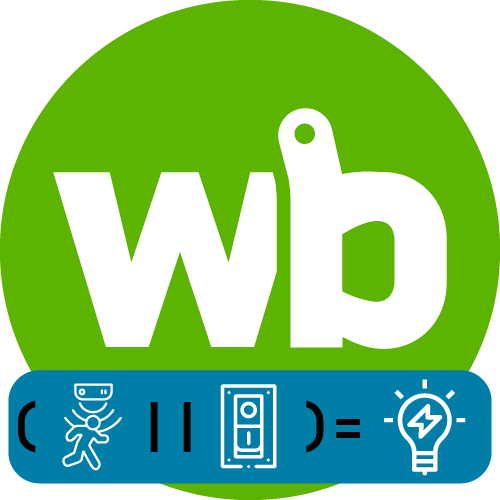
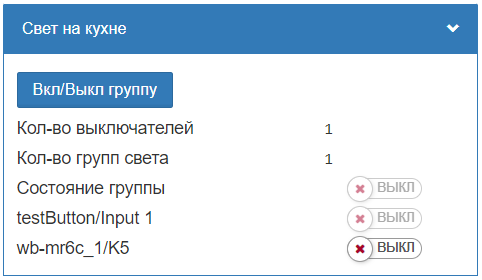
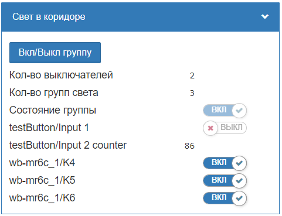
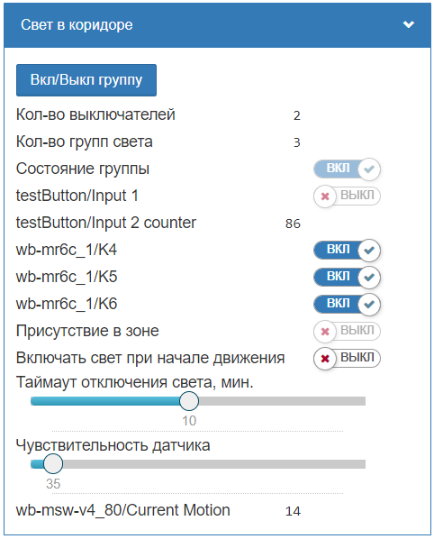

[](https://github.com/SmithLEDs/wb-buttonLight/releases/latest)
[](https://t.me/SmithLEDs)

<h1 align="left">
  <br>
  
  <br>
  <b>Модуль для управления группой света</b>
  <br>
</h1>

## Описание

Данный модуль создает новое виртуальное устройство с новыми контролами для управления светом. 

* Реализована возможность одновременного управления не только одним реле, но и множеством реле.
* Управление из WEB интерфейса по виртуальной кнопке или с физических кнопок или выключателей. Можно указать множество кнопок.
* Есть возможность управления по датчикам движения.
* Возможность работы как Мастер-выключатель.
* Во все новые контролы с физических устройств передаются meta #error и при сбоях подкрашиваются красным цветом.
* Проверка всех топиков на существование. Создается цикличный таймер, который один раз в 5 секунд проверяет все устройства методом `getDevice`. Если после 60 попыток устройство так и не появилось, то загружаются все доступные устройства из переданных в модуль. Обычно устройства долго загружаются после физической перезагрузки контроллера. Поэтому нужно внимательнее передавать топики устройств, избегая ошибок в топиках.

## Передаваемые параметры в функцию и их описание:
- `title` - Описание виртуального устройства (Можно на русском)
- `name` - Имя виртуального устройства (Будет отображаться в новом виртуальном кстройстве как `name/...` )
- `targetButton` - Одиночный топик или массив топиков, по изменению которых будет происходить переключение света (Кнопки, выключатели)
- `targetlight` - Одиночный топик или массив топиков, которыми будет происходить управление (Реле)
- `master` - Управление группой по принципу Мастер-выключателя
- `targetMotion`- Одиночный топик или массив топиков, по которым будет отслеживаться движение для включения или отключения группы света (Необязательный - если не указать, то и не создадутся контролы для управления по движению).

## Примеры

На этом этапе у вас уже должен быть загружен модуль в контроллер. Смотри инструкцию на [главной странице](https://github.com/SmithLEDs/wirenboard#установка-модулей-в-контроллер).

### 1. Одна лампочка - один выключатель.

Классический пример по управлению одной нагрузкой с одного выключателя. В функцию `createLightingGroup` передаем четыре параметра:
- `Свет на кухне` - Описание виртуального устройства (Можно на русском)
- `Light_kitchen` - Имя виртуального устройства (Будет отображаться в новом виртуальном кстройстве как `name/...` )
- `but` - Одиночный топик или массив топиков, по изменению которых будет происходить переключение света (Кнопки, выключатели)
- `light` - Одиночный топик или массив топиков, которыми будет происходить управление (Реле)


```js
var button = require('moduleButtonLight'); // Подключим наш модуль


var but = 'testButton/Input 1';     // Создаем переменную с указанием топика физической кнопки
                                    // или 'testButton/Input 1 counter' для выключателя без фиксации
var light = 'wb-mr6c_1/K5';         // Создаем переменную с указанием реле, на которое подключена лампочка

// Создаем виртуальное устройства при помощи подключенного модуля
button.createLightingGroup('Свет на кухне' , 'Light_kitchen' , but , light );    
```
<h1 align="center">
  
  <br>
</h1>

Создается новое виртуальное устройство. В него автоматически попадают указанные в переменных `but` и `light` контролы кнопок и реле. Новые контролы для кнопок или выключателей доступны только для чтения и отображения реального состояния физических устройств. Для контролов реле доступно управление прямо из виртуального устройства, сделано больше для визуальной наглядности. Так же отображается общее количество кнопок и реле. Топик `Состояние группы` отображает общее состояние реле и работает по принципу - если хоть одно реле включено, то состояние группы считается включенным.

### 2. Три лампочки - два выключателя.
Усложним задачу и будем управлять группой нагрузок с двух разных мест.

```js
var button = require('moduleButtonLight'); // Подключим наш модуль

// Создаем переменную с указанием массива топиков физических кнопок
// Один выключатель типа switch и одна кнопка без фиксации с счетчиком коротких нажатий
var but = [
    'testButton/Input 1',
    'testButton/Input 2 counter'
];     

// Создаем переменную с указанием массива реле, которыми надо управлять
var light = [
    'wb-mr6c_1/K4',
    'wb-mr6c_1/K5',
    'wb-mr6c_1/K6'
];         

// Создаем виртуальное устройства при помощи подключенного модуля
button.createLightingGroup('Свет в коридоре' , 'Light_hallway' , but , light );    
```
<h1 align="center">
  
  <br>
</h1>

### 3. Три лампочки - два выключателя и датчик движения.
Добавим управление при помощи датчика движения. Количество передаваемых параметров увеличилось:
- `false` - Управление группой по принципу Мастер-выключателя
- `motion`- Одиночный топик или массив топиков, по которым будет отслеживаться движение для включения или отключения группы света (Необязательный - если не указать, то и не создадутся контролы для управления по движению).

```js
var button = require('moduleButtonLight'); // Подключим наш модуль

// Создаем переменную с указанием массива топиков физических кнопок
// Один выключатель типа switch и одна кнопка без фиксации с счетчиком коротких нажатий
var but = [
    'testButton/Input 1',
    'testButton/Input 2 counter'
];     

// Создаем переменную с указанием массива реле, которыми надо управлять
var light = [
    'wb-mr6c_1/K4',
    'wb-mr6c_1/K5',
    'wb-mr6c_1/K6'
];         

// Добавляем переменную, в которой указываем топик датчика движения
var motion = 'wb-msw-v4_80/Current Motion';

// Создаем виртуальное устройства при помощи подключенного модуля
button.createLightingGroup('Свет в коридоре' , 'Light_hallway' , but , light , false , motion );    
```
<h1 align="center">
  
  <br>
</h1>

Теперь к виртуальному устройству добавились еще дополнительные контролы для настройки чувствительности и времени таймаута отключения света при прекращении движения. Если контрол `Включать свет при начале движения` включен, то как только обнаружится движение больше указанного в `Чувствительность датчика`, то вся группа света включится. При прекращении движения или при включении света физическим/виртуальным выключателем будет взводиться таймер на указанное кол-во минут. Таймер сбрасывается, если появилось движение или свет выключился.

Если нужна длительная задержка отключения контрола `Присутствие в зоне`, а не мгновенная, то:
- Вместо `Current Motion` нужно передать контрол `Max Motion`
- В конфигурационном файле `Настройка драйвера serial-устройств` у нужного устройства измените параметр `Движение/Время усреднения движения` на нужное кол-во секунд.

### 4. Мастер выключатель.
Если хоть одна группа света горит, то происходит отключение и запоминание состояний реле. При повторном нажатии загорается только те реле, которые были включены. Пример приводить не буду, просто в пятый параметр надо передать `true`.

## Версии `wb-rules`, на которых проверялась работоспособность:

- `v2.21.1-2-g9c86d73`
- `v2.23.1-1-ge77bad7`